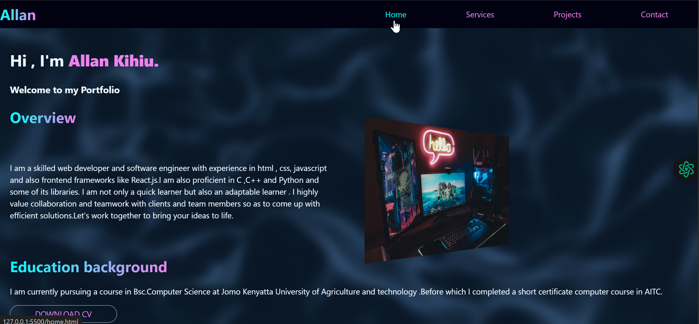

# Allan-Kihiu-Portfolio
  Personal Portfolio

Welcome to my **Personal Portfolio**! This project showcases my web development skills, projects, and experience in an interactive and visually appealing manner. It is built using **HTML and CSS**, ensuring a fast and responsive design across all devices.

#  Features

**Fully Responsive Design** – Works on desktops, tablets, and mobile devices.  
**Modern UI/UX** – Clean and professional aesthetics with smooth animations.  
**Interactive Sections** – About Me, Services, Projects and Contact.  
**Optimized Performance** – Lightweight and fast-loading website.  
**Cross-Browser Compatible** – Works on Chrome, Firefox, Edge, and Safari.  
**SEO-Friendly** – Structured content for better search engine visibility.  

# Live Demo

🔗 [View Portfolio Live](https://allan-kihiu-portfolio.netlify.app)

## 🛠️ Technologies Used

- **HTML5** – Semantic and structured markup.
- **CSS3** – Responsive styling with modern animations.

## 📂 Project Structure

📦 portfolio-project
 📂 images
 📂 css
 📜 home.html
 📜 services.html
 📜 projects.html
 📜 contact.html
 📜 README.md
## 📥 Installation & Setup

To run this project locally, follow these steps:

1️⃣ **Clone the Repository**
sh
 git clone https://github.com/Royaltie-byte/Allan-Kihiu-Portfolio.git
 cd Allan-Kihiu-Portfolio

2️⃣ **Open in Browser**
Simply open the `home.html` file in your favorite web browser.

## 📌 How to Use

- Navigate through different sections using the menu.
- Click on project cards for more details.
- Use the contact form or links to connect with me.

## 🎨 Customization

Want to personalize this portfolio? Here’s how:

- Update content in `home.html`.
- Modify styles in `style.css`.
- Replace images in `images/`.

## 🤝 Contributing

Contributions are welcome! If you'd like to improve this project:

1. **Fork the repository**
2. **Create a new branch** (`feature/new-section`)
3. **Commit your changes**
4. **Push to your fork and submit a Pull Request**

## 📝 License

This project is licensed under the **MIT License**. Feel free to modify and use it for personal projects!

---
💡 **Let's Connect!**
- 🌐 [Portfolio](https://allan-kihiu-portfolio.netlify.app)
- 💼 [LinkedIn](https://www.linkedin.com/in/allan-kihiu)

⭐ Don't forget to **star** this repo if you like it!
